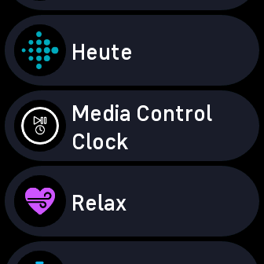
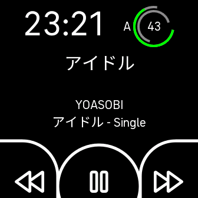

# Fitbit Versa 4 Media Control Application

Considering Fitbit REALLY lobotomized the Versa 4, as it can't do anything aside from fitness tracking and some smaller side things, I took things into my own hands and just wrote something myself

(I'll likely still return the damn thing)

## Features

- Control Music from the comfort of your wrist (Play/Pause, Previous Track, Next Track)
  - Support for Pinpoint controlling specific players, rather than the Standard Media buttons arriving at the first player they find
  - Multi-Player support: Switch using the Battery Icon (current Player is indicated by the letter next to it)
  - Currently available Players: Poweramp (Using Intent API), Apple Music (using generic Media APIs provided by Tasker with Package filter)
  - big control buttons alinged around the lower edge for easy access even if you cannot see overly well
  - haptic feedback on the control buttons for feedback
  - View what's currently playing (Title, Artist, Album)
    - Including Unicode and stuff (See Screenshot below)
- Protect your Tasker API using a key attached to the requests
- By using the Package filter in Tasker the Package targeted by the Apple Music Tasks can be easily modified
- Still enough space for a big Digital Clock
- Big and handy battery icon with percentage and neat colors (traced from "honeycomb" style Battery Icon often seen in Custom Roms) using fitbit's SVG-like design language.

## Credits and Thanks

- [Christian Mengler (cmengler)](https://github.com/cmengler)
  - https://github.com/cmengler/fitbit-app-versa4 (Sample App for Versa 4 that served as the fork base and introduced me into some basics)
  - https://github.com/cmengler/fitbit-spotify-hr-versa4 (This game me the initial idea to just go "screw it gotta do it myself" and really learned a whole lot on the UI coding from it)
- [TimeToogo](https://github.com/TimeToogo)
  - https://github.com/TimeToogo/spotify-hr the original Spotify Heart rate player that cmengler forked to the Versa 4 (also I stole the messagebroker from there, with permission)
- [Peter McLennan also known as Gondwana/gondwanasoft](https://github.com/gondwanasoft)
  - https://github.com/gondwanasoft/fitbit-big-time (a simple settings application to learn from)
  - https://github.com/gondwanasoft/fitbit-file-saver (fetch and File Transfers)
  - his frankly outstanding support on Discord
- [Guy_ from the Fitbit Community](https://community.fitbit.com/t5/user/viewprofilepage/user-id/13486706)
  - awesome help and support in the forum
- Font Awesome for the awesome icons
- Fitbit (despite all the issues)
  - for at least providing a semi-decent dev Platform that is not crazy restrictive,
  - language selection that despite using a super old standard is generally workable if you have experience with JS, SVG and CSS and feels a good bit easier to work than e.g. making an Android App,
  - like the time to first Proof of Concept (basically a single button that does the request to the compaion, the companion to tasker, tasker to player) with no prior fitbit exprience was 2 and a half hours [Gondwana said that would have taken him weeks](https://discord.com/channels/355793206182412290/355793206635659264/1176638728689680474)
- Tasker for the 6.2 Featrure of Webhooks

# Notes for use:

1) Before building your own copy, make yourself a UUID for the package and change any identifiers to your liking to avoid possible collisions
2) if you intend to sideload via the debug tool, make the `appType` into `app` instead of `clockface` because if you sideload a clockface you can easily put yourself into an annoying state regarding clockfaces you need to reset your watch to get out of.
3) if you want to make it as a clockface, test as app first and then make yourself a private app on GAM.
4) Access to the Developer Features on the Watch needs a fitbit developer account, which is as easy as having a normal Fitbit Account (including through Google) and accepting the Platform terms at [the GAM](https://gam.fitbit.com/), you will be required to log in when using the Fitbit command line tool
5) Publishing a Fitbit app (including "limited distribution", aka a private app only people with a link can access), requires accepting their Pulishing terms, which can equally be done at the GAM
6) The fitbit app is prone to disabling the developer connection from time to time, just turn it on again if needed
7) if the phone or watch disconnect (which can happen easily enough) just use `connect phone` and `connect device` to reconnect.
8) if you are on Linux, add the udev rule `SUBSYSTEM=="usb", TAG+="uaccess", TAG+="udev-acl", ATTRS{idVendor}=="2687", ATTRS{idProduct}=="fd13"` (if you use a different watch, the identifiers may vary)
9) To use Webhooks with Tasker you need Version 6.2 which is in Beta last time I checked.

🚧 All content within this repository is provided for educational purposes only. Use at your own risk. 🚧


## Screenshots

| App List                                | App                           |
|-----------------------------------------|-------------------------------|
|  |  |


The following has been taken from the Readme of the Versa 4 Sample App.

## Quick Start

To summarise in four steps:

- [Build the app](#build-the-app)
- [Prepare the bridge](#prepare-the-bridge)
- [Connect the devices](#connect-the-devices)
- [Install the app](#install-the-app)

### Building

```sh
cd app && \
yarn install && \
yarn build
```

### Prepare the bridge

Open Fitbit app, access the **Developer Menu**, toggle on **Developer Bridge** and wait for the "Waiting for Studio" status.

On the Versa 4/Sense 2, connect the device to charger, goto **Settings** and navigate to **Developer bridge**, toggle **USB debugging** on.

Enable the `FITBIT_QA_COMMANDS` environment flag, this allows the device USB host to be discoverable.

```sh
export FITBIT_QA_COMMANDS=1
```

Optionally enable the `FITBIT_DEVBRIDGE_DUMP` environment flag to capture all developer bridge protocol messages for debugging purposes.

```sh
export FITBIT_DEVBRIDGE_DUMP=1
```

### Connect the devices

NOTE: When you first start the `debug` command, you may be requested to login to your Fitbit developer account.

```sh
yarn debug
```

Once connected and the `fitbit$` prompt is ready, type `hosts` to verify the watch and phone (companion host) can be found.

```sh
fitbit$ hosts
Device Hosts:
[
  {
    displayName: 'Hera',
    available: true,
    roles: [ 'APP_HOST' ],
    connect: [AsyncFunction: connect]
  }
]
Phone Hosts:
[
  {
    available: true,
    connect: [Function: connect],
    displayName: 'Samsung SM-G991B',
    roles: [ 'COMPANION_HOST' ]
  }
]
```

Now, connect! First start with `connect phone`, followed by `connect device`.

```sh
fitbit$ connect phone
Auto-connecting only known phone: Samsung SM-G991B
fitbit$ connect device
Auto-connecting only known device: Hera
```

### Install the app

```sh
fitbit$ build-and-install

> testapp@1.0.0 build
> fitbit-build

[warn][build] Targeting proposed API may cause your app to behave unexpectedly. Use only when needed for development or QA.
[warn][settings] This project is being built without a settings component. Create a file named settings/index.tsx, settings/index.ts, settings/index.jsx or settings/index.js to add a settings component to your project.
[info][app] Building app for Fitbit Versa 4
[info][companion] Building companion
[info][build] App UUID: 2bcb9c0f-493b-4ec5-9fe0-07039a28ffa1, BuildID: 0x09256fc65528043a
No app package specified. Reloading ./build/app.fba.
Loaded appID:2bcb9c0f-493b-4ec5-9fe0-07039a28ffa1 buildID:0x09256fc65528043a
App install complete (full)
Companion install complete (full)
Launching app
Companion: Loaded and evaluated: file:///android_asset/bootstrap.js                                                                                (js-engine-bootstrap.html:9,1)
Companion: Companion code started                                                                                                                        (companion/index.js:5,1)
Companion: Loaded and evaluated: file:///data/user/0/com.fitbit.FitbitMobile/app_companions/2bcb9c0f-493b-4ec5-9fe0-07039a28ffa1/0x09256fc65528043a/companion.js                                                                                                                                                                                 (js-engine-bootstrap.html:9,1)
Companion: Companion launched by [launchedOnTracker]
```
